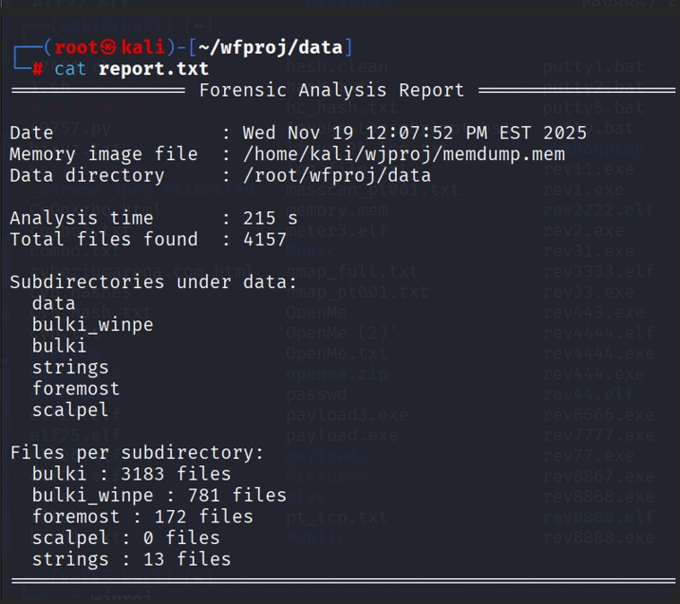
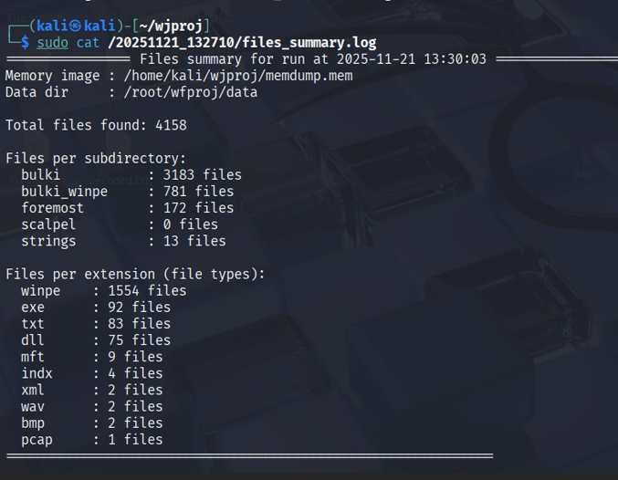
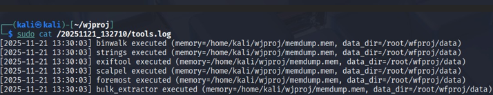

# WINDOWS-FORENSICS 🕵‍♂

[](https://github.com/itaybechor-ui/WINDOWS-FORENSICS/actions/workflows/shellcheck.yml)


## 📄 Full Project Report (PDF)

You can view the full Windows Forensics project report here:  
[Download WFPROJ.pdf](docs/WFPROJ.pdf)

## 🖼 Screenshots (Quick Proof)





> ⚠ *DISCLAIMER:* This project is for educational and security training purposes only.  
> It analyzes Windows memory images (like memdump.mem) inside a controlled lab environment  
> and must *not* be used on systems without explicit authorization.

Automated *Windows Memory Forensics* project written in Bash as part of my Cyber Security studies at *John Bryce College*.  
The main script wfproj.sh analyzes a Windows memory image (memdump.mem) using classic forensics tools and generates a structured report with all findings.

---

## 📚 Table of Contents

- [Overview](#overview)
- [Tools Used](#tools-used)
- [Evidence](#evidence)
- [Architecture](#architecture)
- [Requirements](#requirements)
- [Installation](#installation)
- [Usage](#usage)
- [Example Output](#example-output)
- [Project Structure](#project-structure)
- [Forensics Coverage](#forensics-coverage)
- [Future Improvements](#future-improvements)
- [Hebrew Summary](#hebrew-summary)
- [Contact](#contact)

---

## Overview

wfproj.sh is a *one-click Windows memory forensics pipeline*:

- Runs on *Kali Linux*
- Processes a memory image called **memdump.mem**
- Orchestrates several forensics tools automatically
- Saves all raw results into timestamped log folders
- Produces a final summary report (report.txt) for documentation / PDF export

The goal is to simulate a real investigation on captured RAM from a Windows machine and to standardize evidence collection and analysis.

---

## 🛠 Tools Used

This project focuses on classic memory/disk forensics utilities:

- *bulk_extractor* – scans raw memory for:
  - email addresses  
  - URLs, domains  
  - credit-card–like patterns and other artifacts  

- *scalpel* – file carving based on headers/footers, used to recover:
  - images (JPEG/PNG)  
  - documents and other file types from memdump.mem  

- *foremost* – additional file carving engine used to validate / complement scalpel results  

- *binwalk* – scans the memory image for embedded files, compressed data, and signatures inside memdump.mem  

- *exiftool* – extracts metadata from carved files (especially images and documents), such as:
  - timestamps  
  - camera / software information  
  - authors, titles and other EXIF/metadata fields  

All these tools are executed by wfproj.sh and their outputs are written into organized log files.

---

## 💾 Evidence

The main evidence file analyzed in this project:

- **memdump.mem** – Windows memory image used throughout the lab  
  - Collected from a Windows machine in a controlled lab environment  
  - Contains active processes, strings, network traces and artefacts present at capture time  
  - Used as the single input source for all tools in this project

You can replace memdump.mem with your own memory image (same filename or adjust the path in the script).

---


## 🧱 Architecture

High-level flow of wfproj.sh:

1. Initialize environment & directories (data, logs, timestamped run folder).
2. Verify that memdump.mem exists in the expected location.
3. Run analysis steps in sequence:
   - scanning with *bulk_extractor*
   - carving files with *scalpel* and *foremost*
   - scanning embedded data with *binwalk*
   - extracting metadata with *exiftool*
4. Save each tool’s raw output into dedicated log files.
5. Aggregate key findings into data/report.txt.
6. Print a short summary to the terminal with the path to all results.

---

## 🧰 Requirements

- *Kali Linux* (or any modern Linux distribution)
- Bash shell
- Installed tools:
  - bulk_extractor
  - scalpel
  - foremost
  - binwalk
  - exiftool
- A Windows memory image named memdump.mem

On Kali, most of these tools can be installed via apt.

---


## 📥 Installation

bash
# 1) Clone the repository
git clone https://github.com/itaybechor-ui/WINDOWS-FORENSICS.git

# 2) Enter the project directory
cd WINDOWS-FORENSICS

# 3) Make the main script executable
chmod +x wfproj.sh


---

## ▶ Usage

bash
# Run the pipeline (make sure memdump.mem exists in the expected path)
./wfproj.sh


Outputs are saved under:
- data/ (main outputs)
- a timestamped run folder (logs + summaries)

---

## Example Output

```text
┌──────────────────────────────────────────────────────────────┐
│ 🟡  Forensic Analysis Report  —  12:07:52                     │
├──────────────────────────────────────────────────────────────┤
│ Date:              Wed Nov 19 12:07:52 PM EST 2025            │
│ Memory image file: /home/kali/wjproj/memdump.mem              │
│ Data directory:    /root/wfproj/data                          │
├──────────────────────────────────────────────────────────────┤
│ Analysis time:      215 s                                     │
│ Total files found:  4158                                      │
├──────────────────────────────────────────────────────────────┤
│ Subdirectories:                                               │
│   data                                                       │
│   bulki_winpe                                                │
│   bulki                                                     │
│   strings                                                   │
│   foremost                                                  │
│   scalpel                                                   │
├──────────────────────────────────────────────────────────────┤
│ Files per subdirectory:                                       │
│   bulki       : 3183 files                                    │
│   bulki_winpe : 781 files                                     │
│   foremost    : 172 files                                     │
│   scalpel     : 0 files                                       │
│   strings     : 13 files                                      │
├──────────────────────────────────────────────────────────────┤
│ Files per extension:                                          │
│   winpe : 1554   exe : 92   txt : 83   dll : 75              │
│   mft   : 9      indx: 4    xml : 2    wav : 2               │
│   bmp   : 2      pcap: 1                                      │
├──────────────────────────────────────────────────────────────┤
│ [+] Tools log saved to:     /20251121_132710/tools.log        │
│ [+] Files summary saved to: /20251121_132710/files_summary.log│
│ [+] Run log saved to:       /20251121_132710/run.log          │
└──────────────────────────────────────────────────────────────┘


---

## Project Structure

text
WINDOWS-FORENSICS/
├── README.md
├── wfproj.sh
├── memdump.mem               # Input evidence
├── data/                     # Main output directory
│   ├── bulki/                # bulk_extractor outputs
│   ├── bulki_winpe/          # bulk_extractor winpe scanner outputs
│   ├── foremost/             # foremost carved files
│   ├── scalpel/              # scalpel carved files
│   └── strings/              # strings outputs
├── report.txt                # Final summary report
└── 20251121_132710/          # Timestamped run folder (logs + summaries)
    ├── tools.log
    ├── files_summary.log
    └── run.log


---

## Forensics Coverage

This section summarizes what each tool produced in *this specific run*:

### bulk_extractor
- Performs feature extraction on raw memory and artifacts
- In this run it generated:
  - bulki/ → *3183 files*
  - bulki_winpe/ → *781 files*
- File-type highlights (from summary):
  - *winpe: 1554, **exe: 92, **dll: 75, **txt: 83, **pcap: 1*

### strings
- Extracts printable strings from the memory image
- Output folder: strings/ → *13 files*

### foremost
- File carving based on headers/footers
- Output folder: foremost/ → *172 files*

### scalpel
- Additional carving tool (sometimes recovers different artifacts than foremost)
- Output folder: scalpel/ → *0 files* (in this run)

### binwalk
- Scans the memory image for embedded signatures and compressed blobs
- Results are recorded in the run logs (e.g., tools.log)

### exiftool
- Extracts metadata from carved files (images/documents)
- Results are recorded in logs and/or exported summaries

---

## Future Improvements

- Add argument support (custom input path instead of fixed memdump.mem)
- Add automatic dependency check + installer helper
- Add optional JSON output report for easy parsing
- Improve report formatting (tables + sections)
- Add more memory-forensics tools (optional modules)

---

## Hebrew Summary

פרויקט אוטומטי ל־*Windows Memory Forensics* ב־Bash.  
הסקריפט wfproj.sh מנתח קובץ זיכרון (memdump.mem) ומריץ כלים פורנזיים קלאסיים (bulk_extractor / foremost / scalpel / binwalk / exiftool).  
בסיום הוא יוצר:
- תיקיית data/ עם פלטים מסודרים
- תיקיית ריצה עם Timestamp ללוגים
- דוח מסכם report.txt שמרכז את הממצאים

---

## Contact

- GitHub: *itaybechor-ui*


